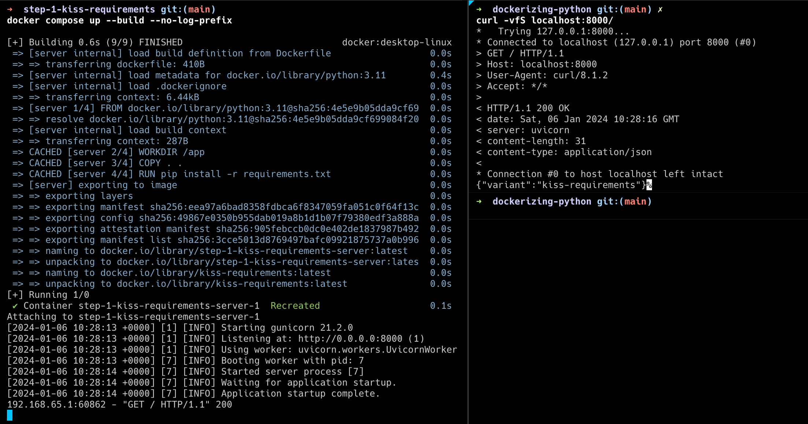

# Dockerizing Python

## TL;DR

For the impatient, you can always skip and the take The Red Pill 💊 and skip to
the [final result](#final-result) of the series.

## What is this?

This repository contains a series of examples on how to Dockerize Python applications. I tried to make each stage
"production ready", so you should be able to use any of them as a starting point for your own project.

You can follow along with the video on YouTube: [!TODO]

In each step, we will add a new feature to our Dockerfile, each addition will trade off somthing for something else.
The goal is to end up with a Dockerfile that is both simple, robust and easy to maintain.

## Table of Contents

* [Step 1 - Keep it simple stupid](./step-1-kiss-requirements/README.md) - A simple Dockerfile
* [Step 2 - Keep it simple - with Poetry](./step-2-kiss-poetry/README.md) - A simple Dockerfile with Poetry
* [Step 3 - Basic Improvements](./step-3-basic-improvements/README.md) - A more robust Dockerfile, with a few
  improvements
* [Step 4 - Nontrivial Improvements](./step-4-nontrivial-improvements/README.md) - Advanced Dockerfile features
* [Step 5 - Growing Pains](./step-5-larger-project/README.md) - Larger projects require extra care
* [Extra 1 - Compiling Dependencies](./extra-1-compiling-dependencies/README.md) - Handling packages that require
  compilation
* [Extra 2 - Need for Speed](./extra-2-need-for-speed/README.md) - Need For Speed - Caching everything
* [Extra 3 - Moving Complexity](./extra-3-moving-complexity/README.md) - Moving complexity away from the Dockerfile into
  pre-commit hooks
* [Final Result](#final-result) - The final result of the series

## Pre-requisites

To follow along with this series, you will need the following pieces of software installed + a basic understanding of
how to use them:

* [Docker](https://docs.docker.com/get-docker/) - A container runtime
* [Python 3.11](https://www.python.org/downloads/) (Anything above 3.9 should work)
* [Poetry](https://python-poetry.org/docs/#installation) - A Python package manager
* [Pre-commit](https://pre-commit.com/#install) - A tool for managing pre-commit hooks

### Running The Examples

In each folder, you will find a `README.md` file that explains the changes made in that step, and a `Dockerfile` that
contains the final result of that step. To see the final result of each step in action, you can run:

```bash
cd <step-folder>
docker compose up --build
```

# A Starting Point

This is our stupidly simple starting point:

```dockerfile
FROM python:3.11
WORKDIR /app
COPY . .
RUN pip install -r requirements.txt
CMD ["gunicorn", "kiss.main:app"]
```

We'll start with this Dockerfile, and incrementally improve it until we have a
production-ready image. I'll see you in [Step 1](./step-1-kiss-requirements/README.md#a-starting-point), and we'll build
up from there.

[](./step-1-kiss-requirements/README.md#a-starting-point)

# Final Result

Congratulations! You've reached the end of the series. This is our final [Dockerfile 🐳](Dockerfile):

```dockerfile
# Use the official Python image. Beware of -slim or -alpine here!
FROM python:3.11

# Configure Python to behave well inside the container.
ENV PYTHONDONTWRITEBYTECODE=1 \
    PYTHONUNBUFFERED=1 \
    PYTHONFAULTHANDLER=1 \
    PIP_DISABLE_PIP_VERSION_CHECK=1

# Set the working directory to /app.
WORKDIR /app

# Copy only the (auto-generated) requirements.txt file
COPY ./requirements.txt ./

# Install dependencies (with caching).
RUN --mount=type=cache,target=/root/.cache/pip \
    pip install --require-hashes -r requirements.txt

# Compile "all" Python files in the PYTHONPATH to bytescode (10 levels deep)
RUN python -m compileall $(python -c "import sys; print(' '.join(sys.path), end='')") -r 10

# Copy the rest of the codebase into the image.
COPY . .

# Install the "root" application (with caching).
RUN --mount=type=cache,target=/root/.cache/pip \
    pip install . --no-deps

# Compile our own source code
RUN python -m compileall src -r 10

# Start the production server.
CMD ["gunicorn", "dockerizing_python.main:app"]
```

This file contains all the bells and whistles we've added throughout the series.

### Running The Example

```bash
docker compose up --build
```

## Summary of all the good stuff we did

* Our project is managed with [Poetry](https://python-poetry.org/).
* We separate our dependencies into 3 groups, this gives us granular control over what we install in our image:
    * _common_ - Dependencies that are needed for both development and production. (e.g. `fastapi`)
    * _dev_ - Dependencies that are only needed for development. (e.g. `pytest`)
    * _prod_ - Dependencies that are only needed for production. (e.g. `gunicorn`)
* We use `poetry export` to generate a `requirements.txt` file. (
  see [step-4-nontrivial-improvements](./step-4-nontrivial-improvements/README.md))
    * Optionally with a [Pre-commit](https://pre-commit.com/) hook to keep it up to date. (
      see [extra-3-moving-complexity](./extra-3-moving-complexity/README.md))
* We utilize Docker's [build cache](https://docs.docker.com/build/cache/) to speed up our builds. (see
  [extra-2-need-for-speed](./extra-2-need-for-speed/README.md))
* We only copy what we need into the build context with [`.dockerignore`](./.dockerignore). (see
  [step-5-larger-project](./step-5-larger-project/README.md))

## Summary of all the stuff we avoided

* We managed to get away without multi-stage builds (sometime this is necessary, but not in our case).
  see [extra-3-moving-complexity](./extra-3-moving-complexity/README.md)
* We avoid -slim and -alpine variants of the Python base image.
  see [extra-1-compiling-dependencies](./extra-1-compiling-dependencies/README.md)
* We avoided using a virtual environment inside the container.
  see [step-4-nontrivial-improvements](./step-4-nontrivial-improvements/README.md)

# Things that didn't make the cut

* When would you use -slim or -alpine variants of the Python base image?
    * [This](https://pythonspeed.com/articles/base-image-python-docker-images/) article explains it well.
* Continuous Integration - Using GitHub Actions to build and push our image to a registry.
    * Build Caching is its own can of worms in this case.
* Testing containers with [pytest-testinfra](https://testinfra.readthedocs.io/en/latest/)
* Deployment - Using [GCP Cloud Run](https://cloud.google.com/run) / [Fly.io](https://fly.io/)
* Optimizations - How to make your containers start faster. Several approaches:
    * Keeping things in memory: don't create a new DB connection on every request.
    * Lazy imports: import dependencies only when needed.
    * Smaller images: using less dependencies, consider using -slim.
* Debugging
    * Attaching a shell to a running container
    * Attaching a debugger to the running Python process
* TLS Termination - TL;DR - Use your load balancer for this unless you have a good reason not to.
